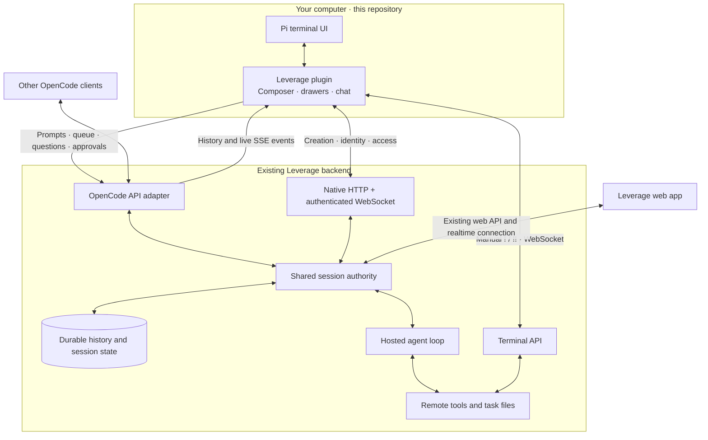
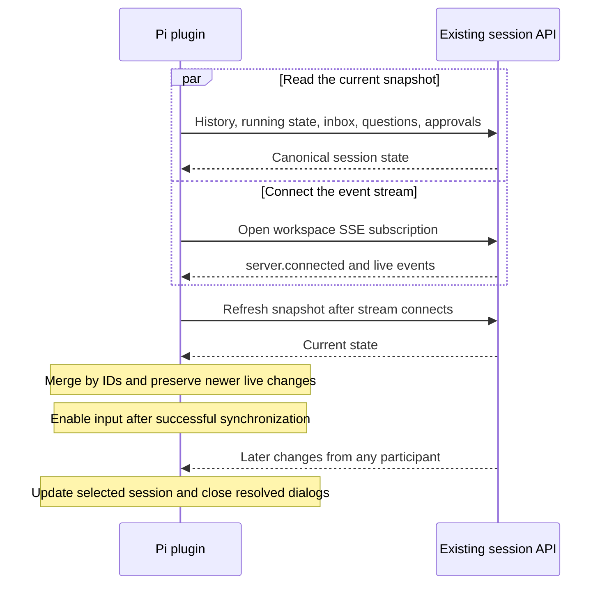
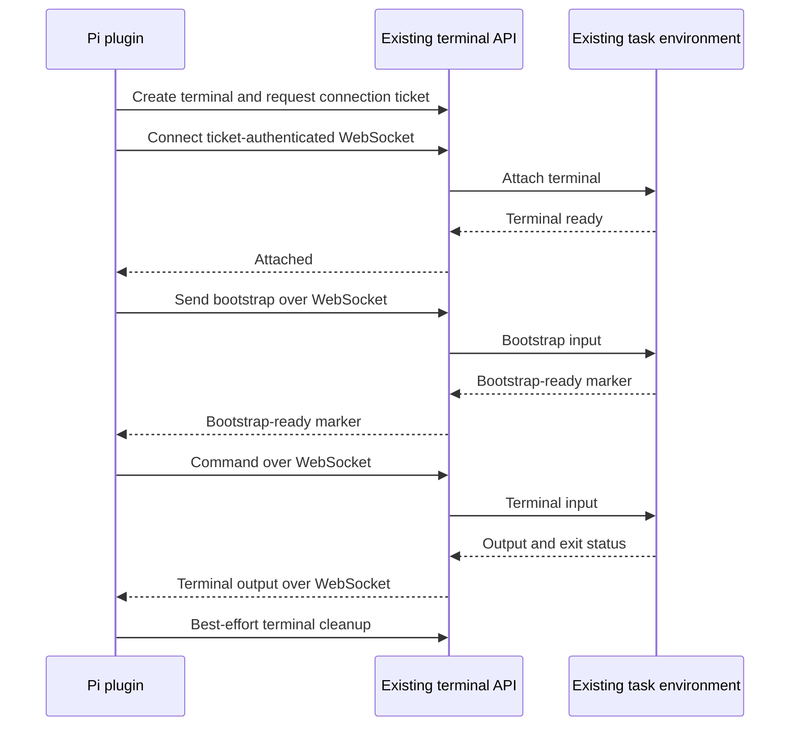

# Pi frontend architecture

Pi is the terminal frontend for shared Leverage sessions. All Pi-specific
behavior lives in this plugin. The existing Leverage backend runs the agent
and owns shared state. This integration adds no backend code or migrations.

## System boundary

The plugin intercepts ordinary input and disables Pi's local agent tools.
Leverage provides the hosted model and agent credentials. Pi renders reported
tool activity without executing those tool calls locally.

The web app and OpenCode share the same underlying sessions. The web app keeps
its existing transport; it does not need to use the OpenCode adapter. The
plugin offers the features the Codex and OpenCode clients offer. Channel chat,
sharing, invitations, and presence stay in the web app.

## What each side owns

| Pi plugin | Existing Leverage backend |
| --- | --- |
| Session picker, search, navigation, and history pages | Sessions, access checks, and durable history |
| Local view of messages, images, reasoning, and tool output | Canonical messages, tool events, and participant identity |
| Prompt editor, queue controls, and stable outgoing message IDs | Delivery queue and hosted agent execution |
| Approval, question, and model-selection dialogs | Permissions, decisions, available models, and selected session model |
| Live-event filtering, reconnect, and snapshot merging | Workspace event stream and authoritative read endpoints |
| Manual-shell transport and local output display | Existing task environment and terminal access |

Pi session files store the association with a Leverage session and display
markers. They do not replace the shared transcript. The plugin reads the local
Leverage CLI profile or explicit connection settings; it keeps renewed access
tokens in memory and excludes credentials from Pi session entries.

## Opening a session and recovering a connection

The event stream covers the workspace. The plugin filters it for the selected
session. The OpenCode stream reconnects with refreshed snapshots. The native WebSocket
resubscribes with per-session replay cursors, drops duplicate durable events,
and refreshes bootstrap snapshots. Version checks retain newer live
author metadata, and per-view abort signals discard stale requests. A startup read failure is reported once. A later successful
synchronization restores input readiness.

Opening a session does not start an agent turn. Switching sessions or closing
Pi leaves the hosted task running. Escape while the session is working, or
`/leverage stop`, explicitly requests interruption.

## Sending a prompt

1. The local draft keeps text, attachments, the channel, and model settings.
2. On first submission, a stable request ID creates an empty native session.
3. Pi creates a stable message ID and sends text and optional images.
4. The API acknowledges the shared inbox item. That acknowledgement is not the agent's answer.
5. Leverage schedules or steers the hosted agent according to the requested delivery mode.
6. History and live events supply the answer, tool activity, and status changes to clients.

Leverage sets the new session's visibility from its defaults. Creation failures
keep the native ID and unsent payload in memory.

If a send is not confirmed, `/leverage retry` reuses its message ID. The plugin
does not automatically replay a mutation after a network error or fall through
to Pi's local model. Approvals and question answers follow the same shared
authority: another participant can resolve a pending dialog.

## Manual shell commands

`!` and `!!` require a task environment already created by a hosted turn.
The plugin does not provision compute. Output appears locally; it does not
create a shared conversation message or an automatic agent checkpoint.
Cancellation and timeouts request termination and cleanup. Cleanup can fail
if the connection or terminal startup fails.

## Client modules

| Module | Responsibility |
| --- | --- |
| [src/index.ts](src/index.ts) | Pi lifecycle, input interception, session synchronization, and commands |
| [src/config.ts](src/config.ts) | Connection settings and local CLI profiles |
| [src/api.ts](src/api.ts) | HTTP requests, contract validation, token renewal, and SSE |
| [src/history.ts](src/history.ts) | Shared-message projection, rendering, and deduplication |
| [src/session-ui.ts](src/session-ui.ts) | History pages and local session association |
| [src/workspace-api.ts](src/workspace-api.ts) / [src/workspace-schema.ts](src/workspace-schema.ts) | Validated native reads and creation |
| [src/workspace-socket.ts](src/workspace-socket.ts) / [src/workspace-state.ts](src/workspace-state.ts) | Authenticated Node WebSocket, replay, canonical inputs, permissions |
| [src/drawers.ts](src/drawers.ts) / [src/workspace-ui.ts](src/workspace-ui.ts) | Responsive searchable settings and session navigation |
| [src/interactions.ts](src/interactions.ts) | Approval, question, model, and inbox dialogs |
| [src/remote.ts](src/remote.ts) | Manual-shell connection, output limits, cancellation, and cleanup |

Pi loads `src/index.ts` through the package's extension metadata. The package
uses published protocol dependencies and has no monorepo dependency.

## Existing API connections

| Connection | Wire path |
| --- | --- |
| Sessions and their operations | `/api/opencode/api/session/...` |
| Workspace events | `/api/opencode/api/event` |
| Session terminal creation | `/api/opencode/api/experimental/session/:id/terminal` |
| Terminal ticket and connection | `/api/opencode/api/experimental/persistent-pty/:id/...` |
| Native workspace identity and defaults | `/api/workspaces/...`, `/api/users`, `/api/channels` |
| Native session metadata and access | `/api/sessions/:id/bootstrap` |
| Native creation and replay | `/ws?workspaceId=...&client=terminal` |
| Device-token renewal | `/api/cli/auth/refresh` |

HTTP requests carry a bearer token and workspace header. The terminal socket
uses a connection ticket. The native WebSocket uses Node `ws` with an
Authorization header. Both transports share the same credential owner and
coalesced refresh; bearer tokens never enter a WebSocket URL. HTTP errors show the host, endpoint, a bounded server
reason when available, and a request ID when supplied. Query values and full
response payloads are excluded from diagnostic text.

## Current limits

- Session forks, reverts, and deletion are not offered by this integration.
- Composer drafts survive navigation in the running process, not a Pi restart. Unconfirmed setup payloads remain available for retries until the user leaves that creation draft.
- Model knobs without an existing choices API inherit server defaults.
- Session replay uses durable cursors.
- Local Pi skills and local model settings do not configure the hosted agent.
- Custom question answers appear only when the server's form allows them.
- Manual shell output is local to Pi; use a hosted prompt for shared command activity.
- The live view is bounded; older conversation content remains available through history pages.

See [README.md](README.md) for installation, commands, and connection settings.
