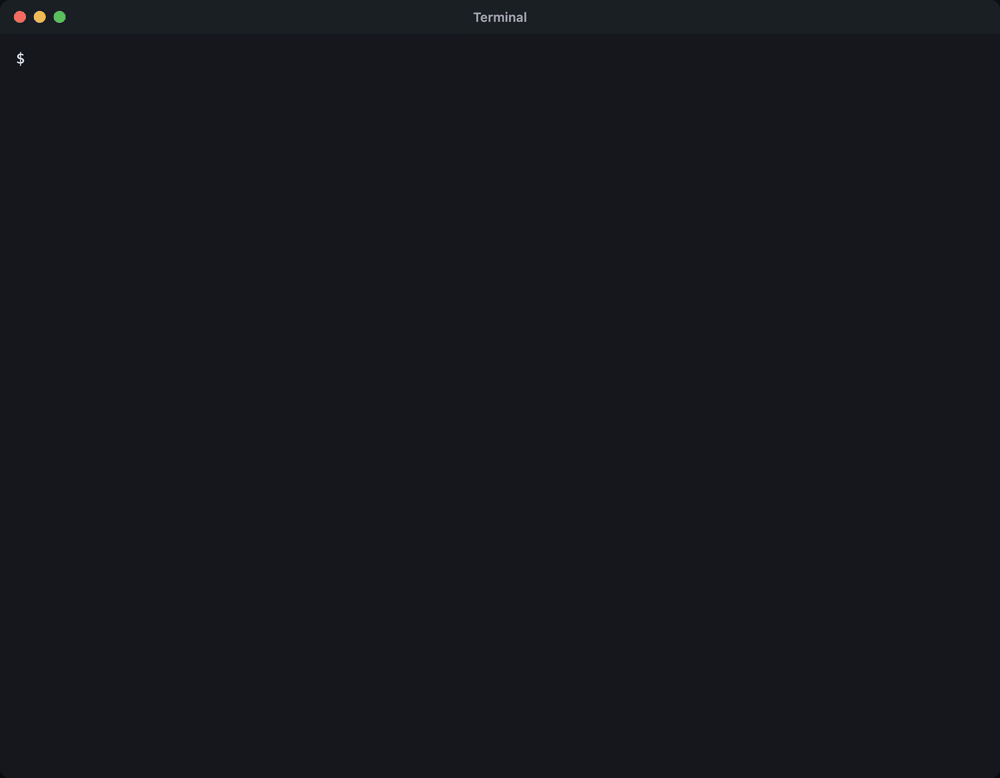

# <picture><source media="(prefers-color-scheme: dark)" srcset="docs/media/leverage-dark.svg"></picture> Leverage in Pi

<a href="LICENSE"></a>
<a href="https://github.com/leverage-computer/pi-plugin/actions/workflows/ci.yml"></a>
<a href="package.json"></a>
<a href="#get-started"></a>
<a href="#get-started"></a>

[Install](#install) ·
[Features](#features) · [Commands](#commands) · [Settings](#settings) · [leverage.computer](https://leverage.computer)

[](docs/media/00-setup.mp4)

## Install

```sh
npm install -g @earendil-works/pi-coding-agent@0.99.1
pi install git:github.com/leverage-computer/pi-plugin
pi
```

Then, in Pi:

- `/leverage login`: sign in.
- `/leverage new`: start a session.
- `/leverage`: open one your team started.
- `/leverage exit`: go back to plain Pi.

## Features

### Start a session

[](docs/media/01-first-session.mp4)

- `/leverage new`, then type what you need. Your first message starts the
  session.
- **F2** picks the model. **Ctrl+V** sends an image with your message.
- Edits show as diffs. Checklists, helpers and background commands get their
  own cards.

### Open your team's sessions

[](docs/media/02-sessions.mp4)

- `/leverage`, or **F3** in a session, lists them. Type to filter, then
  **Enter**.
- Each message shows who wrote it. Anything you send shows up for everyone.

[](docs/media/05-people.mp4)

- Above the composer: who has the session open, who is typing, and whether
  the owner is around. **F1** shows the full list.

### Approve commands

[](docs/media/03-approvals.mp4)

- The question opens on its own. Pick **Approve once** or **Deny**.
- **Escape** approves nothing. **F4** opens the question again.
- Plans to review work the same way.

### See what the agent made

[](docs/media/04-files.mp4)

- `/leverage outputs`: the files the agent made. **Enter** reads one, **Tab**
  saves it here.
- `/leverage files`: all of the session's folders.
- `/leverage changes`: what changed, on which branch, and its pull request.

### Good to know

- Closing Pi doesn't stop the agent.
- Pi can't run `!` shell commands in a session yet. Ask the agent instead.

## Commands

| Type or press | What happens |
| --- | --- |
| `/leverage login` | Sign in |
| `/leverage logout` | Sign out |
| `/leverage new` | Start a new session |
| `/leverage` | Find and open a session |
| `/leverage exit` | Go back to plain Pi |
| **F1** | Pick a channel for a new session |
| **F2** | Pick a model |
| **F3** | Find and open a session |
| **F4** | Review what the agent wants to run |
| **Enter** while the agent works | Steer it after its current step |
| **Alt+Enter** | Queue a follow-up |
| **Alt+Q** | Take queued follow-ups back |
| **Escape** | Stop the agent |
| `/leverage rename <name>` | Rename the session |
| `/leverage history` | Read older messages |
| `/leverage queue <message>` | Send a message after the agent finishes |
| `/leverage archive` | Put the session away |
| `/leverage retry` | Try again when a message didn't send |
| `/leverage skills` | Pick a skill for your next message |
| `/leverage connectors` | The apps your workspace connects to |

In the session list, **Tab** renames or archives a session.

## Access

- The plugin uses your Leverage CLI login, or its own in
  `~/.pi/agent/leverage.json`.
- `/leverage login` sets it up. `/leverage logout` removes it.

## Settings

| To change | Use |
| --- | --- |
| The server | `LEVERAGE_HOST` |
| The workspace | `pi --leverage-workspace <name>` |
| The session Pi opens | `pi --leverage-session <id>` |

Which channels Pi shows: Leverage **Settings → Integrations → What each app
gets**.

## Development

You need Bun 1.4.2, Python 3 and macOS or Linux.

```sh
bun install --frozen-lockfile
bun run check
pi -e .
```

## License

MIT. See [LICENSE](LICENSE).
