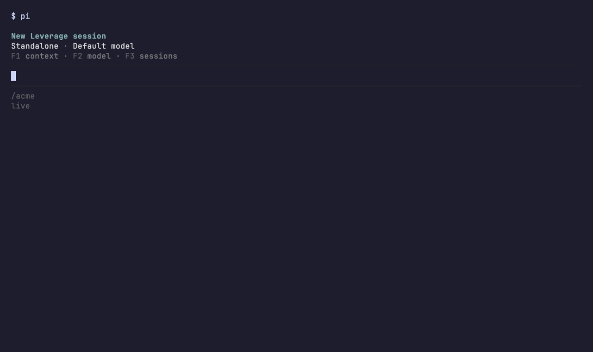

# Leverage in Pi

Talk to your Leverage agents from the terminal.

You type in Pi. The agent runs on Leverage. Your team sees the same
conversation in the web app.


## Get started

You need Node.js 22.19 or newer.

```sh
npm install -g @earendil-works/pi-coding-agent@0.99.1
leverage login
pi install git:github.com/thepresciencecompany/pi-plugin
pi
```

That's it. Pi opens as it always does. Leverage only shows up when you ask
for it:

- Type `/leverage new` to start a session.
- Type `/leverage` to open one your team started.
- Type `/leverage exit` to go back to plain Pi.

## How to use it

### Ask for something



- Type `/leverage new`, then type what you need and press **Enter**.
- Your first message starts the session.
- You'll see **Working** while the agent is busy.
- Want a different model? Press **F2**. In an open session, it switches with
  your next message. New sessions start with the model you used last.
- Pasted an image with **Ctrl+V**? It goes to the agent with your message.
- The agent's edits show as diffs, and its checklist, helpers and background
  commands each get their own card.

[Watch it in full](docs/media/01-first-session.mp4)

### Open a session your team started


- Type `/leverage` to see all sessions. Already in one? Press **F3**.
- Type a few letters to find one, then press **Enter**.
- You'll see who wrote each message.
- Anything you send shows up for everyone.

[Watch it in full](docs/media/02-sessions.mp4)

### Say yes or no to a command


- Sometimes the agent asks before it runs something.
- A yellow line tells you something is waiting.
- Press **F4**, then pick **Approve once** or **Deny**. You only see the
  choices you're allowed to make.
- A plan to review works the same way: approve it, or ask for changes.
- Not sure? Press **Escape**. Nothing gets approved.

[Watch it in full](docs/media/03-approvals.mp4)

### See what the agent made


- Type `/leverage outputs` to see the files the agent made. Press **Enter**
  to read one, or **Tab** to save it in the folder you started Pi in.
- Type `/leverage files` to look through all of the session's folders, or
  to find a file by name.
- Type `/leverage changes` to see what the agent changed, on which branch,
  and its pull request.

[Watch it in full](docs/media/04-files.mp4)

## Handy commands

These keys work once you're in a Leverage session.

| Type or press | What happens |
| --- | --- |
| `/leverage new` | Start a new session |
| `/leverage` | Find and open a session |
| `/leverage exit` | Go back to plain Pi |
| **F1** | Pick a channel for a new session |
| **F2** | Pick a model |
| **F3** | Find and open a session |
| **F4** | Review what the agent wants to run |
| **Escape** | Stop the agent |
| `/leverage rename <name>` | Rename the session |
| `/leverage history` | Read older messages |
| `/leverage queue <message>` | Send a message after the agent finishes |
| `/leverage archive` | Put the session away |
| `/leverage retry` | Try again when a message didn't send |
| `/leverage skills` | Pick a skill for your next message |
| `/leverage outputs` | Files the agent made |
| `/leverage files` | All of the session's folders |
| `/leverage changes` | What changed, and the pull request |
| `/leverage connectors` | The apps your workspace connects to |

In the session list, press **Tab** to rename or archive a session without
opening it.

Good to know:

- Closing Pi doesn't stop the agent. It keeps working.
- Pi can't run `!` shell commands in the session yet. Ask the agent to run them
  instead.

## Try the demo

The demo is a pretend workspace on your own computer. Nothing you do there is
real, so feel free to click around.

```sh
git clone https://github.com/thepresciencecompany/pi-plugin.git
cd pi-plugin
bun install
bun run demo
```

Then, in a second terminal window:

```sh
LEVERAGE_HOST=http://127.0.0.1:4545 LEVERAGE_WORKSPACE=acme LEVERAGE_TOKEN=demo pi -e .
```

- Type `/leverage new`, then ask anything. The agent runs some tests.
- Ask it to "deploy", and it asks for your approval first.

## Settings

Most people never need these. Pi uses your `leverage login` by default.

| To change | Add this to `pi` |
| --- | --- |
| The server | `--leverage-host https://…` |
| The workspace | `--leverage-workspace <name>` |
| Open a session as Pi starts | `--leverage-session <id>` |

To choose which channels Pi shows, open Leverage and go to **Settings →
Integrations → What each app gets**. There you also choose if Pi lists
standalone sessions and sessions other people share with you.

## For developers

You need Bun 1.4.2, Python 3 and macOS or Linux.

```sh
bun install --frozen-lockfile
bun run check
pi -e .
```

To record the videos again, install [VHS](https://github.com/charmbracelet/vhs)
and run `docs/demo/record.sh`.
